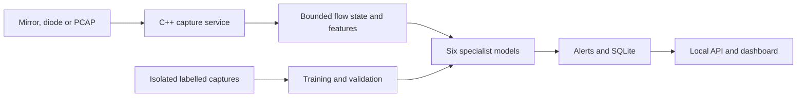

# NetraVerse

**Passive cyber-threat detection for one-way IP traffic**  
Smart India Hackathon 2025 · Problem Statement **SIH26145** · Team **AetherIQ**

NetraVerse is a prototype for detecting suspicious behavior in a passive copy of network traffic. It is designed for monitoring enclaves connected through port mirroring or a data diode: traffic enters the analysis environment, while the detector has no path to query, probe, block, or reconfigure the observed network. The output is a stream of labelled alerts with confidence scores and the traffic features that support them.

## The problem

Critical infrastructure operators often monitor gateway and peering links using a passive mirror or a hardware data diode. An analytics system on the receiving side can inspect packets and exported flows, but it cannot contact a source or destination, complete a handshake of its own, or send a mitigation command into the production network. Encryption further limits what can be observed.

SIH26145 asks for a working prototype that ingests one-way traffic incrementally, extracts features, classifies six threat types, and displays timely, evidence-bearing alerts. The submission must document model training and validation, a defined throughput test, and the limitations of passive observation.

## Threat coverage

| Threat class | Evidence available from passive observation | Important limitation |
|---|---|---|
| Volumetric and protocol DDoS | Packet and flow rates, TCP SYN activity, UDP volume, source diversity and source-IP entropy around a target | Reflection and spoofing are inferred from visible patterns; they cannot always be proven from one vantage point. |
| Botnet C2 beaconing | Repeated flows to a small destination set, inter-arrival times and periodicity over longer windows | A short capture may not contain enough repeated observations. |
| DGA domains and DNS tunnelling | Plaintext DNS query length, character statistics, entropy, n-grams, query rate and record types | Encrypted DNS names are unavailable unless observed elsewhere in plaintext. |
| Encrypted-session malware indicators | Observable TLS/QUIC handshake fields, fingerprints when present, packet sizes and timing | Metadata can indicate suspicious behavior; it does not reveal decrypted malware content. |
| Reconnaissance | Fan-out to destination ports and hosts, SYN attempts and observed responses | One-way visibility may hide responses and reduce confidence. |
| Data exfiltration | Directional byte volume, outbound/inbound asymmetry and deviation from an asset baseline | Direction and baseline must be known; large transfers alone are not proof of exfiltration. |

A flow or observation window may receive more than one label. Missing protocol metadata is represented explicitly rather than interpreted as benign activity.

## System design



The C++ process owns capture, rolling state and inference. It must load the trained model artifacts locally and score each class only when its required event or observation window is ready. One-second rate windows and longer beaconing windows serve different kinds of evidence; a model should not run once per packet merely because a packet arrived. The dashboard reads alerts and operational state from the monitoring host. It never sends a control action across the ingest path.

The proposed storage layer is SQLite for alerts and metrics on a single monitoring server. The alert schema includes `timestamp`, `flow_id`, `threat_class`, `confidence`, `severity` and structured `evidence`. Model and feature versions should accompany scored results so a replay can reproduce them.

### Repository map

```text
frontend-dashboard/            Next.js pages and local API routes
  src/app/(dashboard)/          Overview, alerts, traffic, models and settings
  src/app/api/                  Alerts, health, metrics and model endpoints
service/                       C++ passive capture and detection process
  include/                     Public service headers
  src/                         Capture, state, inference and alert code
  CMakeLists.txt                Native build configuration
ml/                            Lab capture, feature contract and model training
  capture_lab.sh                Passive capture helper
  feature_schema.py             Feature names and ordering
  training/                    Training and evaluation scripts
docs/images/                   Dashboard screenshots and benchmark figures
```

### What the starter code implements

The starter service discussed for this repository parses Ethernet/IPv4 TCP and UDP traffic from a live interface or PCAP and emits JSON Lines for a provisional TCP SYN scan rule. That rule is a baseline, not a trained six-class detector. The ML training scripts expect a labelled feature CSV; the Python and C++ feature calculations must still be made identical and tested on the same capture. The initial dashboard API routes return placeholders until their SQLite queries and service writer are integrated. Update this paragraph when those integrations have been verified in the repository.

## Alert contract

```json
{
  "timestamp": "2026-09-26T10:00:00Z",
  "flow_id": "192.0.2.10:51422-198.51.100.20:443-TCP",
  "threat_class": "RECONNAISSANCE_PORT_SCAN",
  "confidence": 0.91,
  "severity": "MEDIUM",
  "evidence": {
    "unique_destination_ports": 14,
    "observation_window_seconds": 10
  },
  "model_version": null
}
```

This JSON is a **format example**, not a recorded alert. Confidence from a trained model should be calibrated and labelled by model version. The provisional rule's fixed score must not be described as a calibrated model probability.

## Evaluation design

### 100,000-window scenario


The supplied per-class worksheet lists **4,847 threat-positive class windows**, **4,671 true positives**, **176 false negatives** and **237 false-positive class decisions**. If each positive window belongs to exactly one threat class, 95,153 of the 100,000 windows would have no positive threat label. If windows can have multiple labels, the unique positive and negative window counts must be derived from the underlying row-level labels instead.

| Threat class | Positive class windows | Detected (TP) | Missed (FN) | False positives (FP) | Recall | Precision |
|---|---:|---:|---:|---:|---:|---:|
| DDoS | 812 | 793 | 19 | 31 | 97.7% | 96.2% |
| C2 beaconing | 634 | 601 | 33 | 28 | 94.8% | 95.5% |
| DGA / DNS tunnelling | 721 | 698 | 23 | 41 | 96.8% | 94.5% |
| Encrypted-session indicators | 589 | 557 | 32 | 38 | 94.6% | 93.6% |
| Reconnaissance | 1,102 | 1,077 | 25 | 47 | 97.7% | 95.8% |
| Data exfiltration | 989 | 945 | 44 | 52 | 95.6% | 94.8% |
| **Pooled class decisions** | **4,847** | **4,671** | **176** | **237** | **96.4%** | **95.2%** |

Pooled recall is `4,671 / 4,847 = 96.4%`. The unweighted mean of the six class recalls is **96.2%**. Pooled precision is `4,671 / (4,671 + 237) = 95.2%`. The pasted worksheet's “96.0% mean recall” is inconsistent with its own class counts, so this README uses the values calculated from those counts.


<!-- IMAGE 1 PLACEHOLDER: upload netraverse-100k-threat-coverage.png to docs/images/ and uncomment the line below. -->
<!--  -->

<!-- IMAGE 2 PLACEHOLDER: upload netraverse-100k-model-quality.png to docs/images/ and uncomment the line below. -->
<!--  -->

The two supplied figures visualize the example counts. Their captions identify the assumed 100,000-window denominator and the lack of raw evaluation artifacts. They should be regenerated from actual test output before they are described as benchmark results.

### How a measured result will be produced

1. Record each lab capture's ID, scenario, traffic source, attack interval, packet count and capture duration. Keep these notes with the lab run.
2. Label observation windows from the controlled scenario timeline. A capture that contains one attack interval must not label all unrelated traffic as malicious.
3. Separate training, validation and final test by capture session and scenario. Nearby windows from one PCAP must not be split across those sets.
4. Fix the feature definitions and units in `ml/feature_schema.py`. Compare Python training features with C++ replay features for the same windows before training.
5. Train one binary XGBoost model for each class. Choose each decision threshold using validation data only, then freeze the model and threshold.
6. Replay held-out PCAPs through the C++ process. Compare its timestamped alert records against the held-out labels. Record TP, FP, FN and TN per class.
7. Report precision, recall, F1, confusion matrices and false alerts per hour. Publish capture duration and denominators alongside every rate.
8. Record the sustained traffic rate, capture drops, CPU, peak RAM and p50/p95 alert latency. Measure processing latency from the **end of the required observation window** to alert persistence; report the observation time separately.

`recall = TP / (TP + FN)` and `precision = TP / (TP + FP)`. False alerts per hour is `FP / evaluated capture hours`; do not divide by hours unless those hours actually correspond to the evaluated windows. The supplied 72-hour figure would make `237 / 72 = 3.29` pooled false-positive class decisions per hour, subject to confirmation of the test duration and counting method.


### Capacity targets from the proposal

These are design targets until accompanied by a replay log and resource measurements:

| Measure | Target |
|---|---:|
| Sustained throughput | 100 Mbps for 30 minutes on a 4-vCPU, 8-GB RAM host |
| C++ service RAM | At most 248 MB |
| C++ service CPU | At most one vCPU |
| Capture drops | Below 0.0013% |
| Alert persistence delay | p95 at most 2 seconds after the observation window ends |

## Build and run

The commands below correspond to the starter structure. They do not by themselves perform a six-class benchmark.

### C++ service

On Ubuntu or WSL:

```bash
sudo apt update
sudo apt install build-essential cmake pkg-config libpcap-dev
cd service
cmake -S . -B build
cmake --build build
```

Replay an Ethernet PCAP or capture from an authorized interface:

```bash
./build/netraverse --pcap ../path/to/capture.pcap
sudo ./build/netraverse --interface eth0
```

The starter emits alert JSON Lines to standard output. Live capture requires suitable interface permissions. It does not send probes or traffic back into the observed network.

### ML pipeline

```bash
cd ml
python3 -m venv .venv
source .venv/bin/activate
pip install -r requirements.txt
python training/train.py --features data/features.csv --output artifacts
python training/evaluate.py --features data/test_features.csv --models artifacts --output artifacts/test_report.json
```

On PowerShell, activate the virtual environment with `.venv\Scripts\Activate.ps1`. `data/features.csv` and `data/test_features.csv` are inputs to create from labelled lab captures; neither file is included in the repository. The model files in `artifacts/` are generated outputs.

### Dashboard

```bash
cd frontend-dashboard
npm install
npm run dev
```

Open `http://localhost:3000`. Until SQLite and the C++ service writer are integrated, pages should show empty or unknown states rather than invented alerts or a false “connected” status. Keep the SQLite path server-side, for example through `SQLITE_DB_PATH`; never expose database access or capture control to browser code.

## Data handling

PCAPs, extracted feature rows, generated models, SQLite files and secrets should be excluded from Git by default. A small sanitized test fixture may be added only after reviewing addresses, DNS names and payloads. The repository should contain the data recipe, feature contract, labels specification and reproducible commands even when the underlying captures cannot be published.

Lab traffic should be generated only on networks the team controls or is authorized to test. Candidate tools from the problem statement include `iperf3`, Ostinato or TRex for benign load, with isolated scenarios for floods, beaconing, DNS tunnelling and other specified behaviors.

## Reproduction evidence for judges

A complete benchmark submission should include:

- The commit hash and model/threshold versions used for the run.
- Capture and scenario manifests, including the number of evaluated windows per class.
- A description of label boundaries and train/validation/test separation.
- Per-class confusion matrices and machine-readable predictions.
- Replay rate, host specification, process metrics, packet-drop counters and latency percentiles.
- A short screen recording or screenshots showing a replay alert and its supporting evidence.


<!-- DASHBOARD IMAGE PLACEHOLDER: upload a real screenshot to docs/images/dashboard-overview.png and uncomment the line below. -->
<!--  -->

## References

- National Technical Research Organisation, SIH Problem Statement 26145, *AI-Based Detection of Cyber Threats in Unidirectional IP Traffic*.
- Tianqi Chen and Carlos Guestrin, *XGBoost: A Scalable Tree Boosting System* (2016).
- The tcpdump group, libpcap documentation.
- FoxIO, JA4 fingerprinting documentation.

