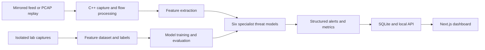

# NetraVerse

**Passive AI-based cyber-threat detection for unidirectional IP traffic**

NetraVerse analyzes a read-only copy of network traffic and presents threat alerts with confidence scores and supporting evidence. It is designed for monitoring environments where the analysis system cannot contact the observed hosts or send traffic back into the protected network.

| | |
|---|---|
| **SIH Problem Statement** | 26145 |
| **Problem title** | AI-Based Detection of Cyber Threats in Unidirectional IP Traffic |
| **Organization** | National Technical Research Organisation (NTRO) |
| **Team** | AetherIQ |

> **Prototype status:** The repository is being developed as a working prototype. Benchmark figures are reported only after they have been measured on labelled, held-out captures.

## Problem

A passive monitoring enclave can inspect a mirrored traffic feed or a data-diode copy, but it cannot probe hosts, complete handshakes, decrypt protected sessions, or issue mitigation commands across the ingest path. The system must therefore make detections from observed packets, flow behavior, and available protocol metadata.

NetraVerse is designed to identify six threat categories:

1. Volumetric and protocol DDoS
2. Botnet command-and-control beaconing
3. DGA domains and DNS tunnelling
4. Malware indicators in encrypted TLS/QUIC sessions
5. Reconnaissance and port scanning
6. Data exfiltration

## Design constraints

- **Passive ingest:** The detector reads a traffic copy. It does not transmit packets to monitored hosts.
- **No payload decryption:** TLS and QUIC analysis uses observable metadata only.
- **Streaming operation:** Packets are processed incrementally; the system is not limited to end-of-capture analysis.
- **Bounded state:** Flow records and queues must expire or enforce configured limits.
- **Evidence-bearing alerts:** Each detection includes the observed features that contributed to the result.
- **Measured performance:** Throughput, packet drops, resource use, and alert latency must be reported for the tested environment.

## Architecture



The C++ service is intended to capture or replay packets, maintain bounded flow state, extract features, run local model inference, and produce alerts. The ML pipeline trains and evaluates six separate binary classifiers. The Next.js dashboard displays service health, traffic metrics, model status, and alerts.

The monitoring path is read-only. Dashboard actions must not trigger probes, blocking, or other commands against the observed network.

## Repository layout

```text
frontend-dashboard/
└── src/app/
    ├── (dashboard)/
    │   ├── page.jsx
    │   ├── alerts/page.jsx
    │   ├── traffic/page.jsx
    │   ├── models/page.jsx
    │   └── settings/page.jsx
    └── api/
        ├── alerts/route.js
        ├── alerts/[id]/route.js
        ├── health/route.js
        ├── metrics/route.js
        └── models/route.js

service/
├── include/
├── src/
└── CMakeLists.txt

ml/
├── feature_schema.py
├── capture_lab.sh
└── training/
    ├── train.py
    └── evaluate.py
```

## Implementation status

The repository should distinguish working behavior from planned integrations.

| Component | Current prototype scope |
|---|---|
| C++ service | Passive Ethernet PCAP/live capture scaffold, IPv4 TCP/UDP parsing, provisional TCP SYN port-scan rule, JSON Lines alert output |
| ML pipeline | Six-model training and evaluation scripts that consume labelled feature rows |
| Capture helper | Passive capture script for authorized lab interfaces |
| Dashboard | Next.js page and API route scaffolding |
| Integration work | Matching C++ and Python feature definitions, trained model loading, SQLite persistence, and live service-to-dashboard data flow |

The current port-scan rule is a baseline, not one of the six trained threat models. The ML scripts expect feature rows; they do not by themselves extract the full feature dataset from PCAP files. Do not describe a component as complete until its implementation and test evidence are in the repository.

## Detection approach

The intended design uses six specialist binary models. A flow or observation window may receive more than one threat label when its behavior supports multiple detections.

| Threat category | Example passive evidence |
|---|---|
| DDoS | Packet and byte rates, protocol mix, source diversity, and source-IP entropy around a destination |
| C2 beaconing | Repeated connections, inter-arrival timing, periodicity, and timing variation toward a small destination set |
| DGA and DNS tunnelling | Query-name length and character statistics, entropy, n-grams, query rate, and record-type anomalies when DNS names are visible |
| Encrypted-session malware indicators | Available TLS/QUIC handshake metadata, packet sizes, timing patterns, and explicit indicators for unavailable metadata |
| Reconnaissance | Source fan-out across destination hosts and ports, SYN attempts, and connection outcomes |
| Data exfiltration | Directional byte imbalance, transfer volume, duration, and deviation from an established baseline |

The model must not treat unavailable fields as evidence of benign behavior. Missing metadata should be represented explicitly. TLS and QUIC payloads must not be decrypted.

## Alert format

Alerts use a structured record similar to:

```json
{
  "timestamp": "2026-09-26T10:00:00Z",
  "flow_id": "source-to-destination-protocol",
  "threat_class": "RECONNAISSANCE_PORT_SCAN",
  "confidence": 0.91,
  "severity": "MEDIUM",
  "evidence": {
    "unique_destination_ports": 14,
    "observation_window_seconds": 10
  },
  "model_version": "example-version"
}
```

The values above illustrate the schema only; they are not a detection result. An alert should contain the timestamp, flow identifier, threat class, confidence, severity, and supporting evidence. Model version and endpoint details should be included when available.

## Benchmarking

### Target versus measured results

The project proposal sets the following engineering targets. They are **targets, not achieved results**, until a benchmark run produces evidence.

| Measure | Proposal target | Verified result |
|---|---:|---:|
| Detection recall by threat class | 95–96% target | Not yet reported |
| Sustained replay throughput | 100 Mbps for 30 minutes on a 4-vCPU, 8-GB RAM host | Not yet reported |
| C++ service memory | At or below 248 MB | Not yet reported |
| C++ service CPU | At or below one vCPU | Not yet reported |
| Capture drops | Below 0.0013% | Not yet reported |
| Alert processing latency | p95 at or below 2 seconds after the observation window ends | Not yet reported |

The two-second latency target begins **after the evidence-collection window ends**. Beaconing detection may require a longer observation period; report that separately from processing latency.

### Per-class detection results

Fill this table from a held-out test set. Count labelled positive observation windows as “Threat windows”; count true positives as “Detected.” Report false positives as well, since a high recall with an unusable false-alert rate is not sufficient.

| Threat class | Threat windows | Detected (TP) | Missed (FN) | False positives (FP) | Recall | Precision | F1 | False alerts/hour |
|---|---:|---:|---:|---:|---:|---:|---:|---:|
| DDoS | — | — | — | — | — | — | — | — |
| C2 beaconing | — | — | — | — | — | — | — | — |
| DGA / DNS tunnelling | — | — | — | — | — | — | — | — |
| Encrypted-session indicators | — | — | — | — | — | — | — | — |
| Reconnaissance | — | — | — | — | — | — | — | — |
| Data exfiltration | — | — | — | — | — | — | — | — |

Use:

- **Recall** = TP / (TP + FN): fraction of labelled threat windows detected.
- **Precision** = TP / (TP + FP): fraction of alerts that are correct.
- **F1** = harmonic mean of precision and recall.

A 95–96% figure must name its metric. “Efficiency” is ambiguous; it could mean recall, accuracy, throughput, or resource efficiency. For threat detection, report at least recall, precision, F1, and false alerts per hour.

### Benchmark method

For a defensible result:

1. Generate benign and threat traffic in an isolated lab using documented recipes.
2. Keep capture IDs, scenario IDs, time ranges, and labels with the experiment notes.
3. Split train, validation, and test data by capture scenario, not by randomly selected rows. This reduces leakage from near-duplicate windows.
4. Choose model thresholds using validation data only.
5. Run the final metrics once on held-out test scenarios.
6. Include per-class confusion matrices and the number of positive and negative examples.
7. Replay each benchmark capture at a stated rate and duration.
8. Record hardware, software versions, CPU, RAM, throughput, capture drops, and p50/p95 latency.
9. Keep observation-window duration separate from processing latency.

Do not publish a benchmark image showing 95–96% as achieved performance until it is generated from these measured results. Once available, add the chart under `docs/images/` and embed it here:

```markdown

```

The chart should include the test-set size for each class and label the metric and test environment.

## Data and privacy

The repository does not include packet datasets. Capture data can contain sensitive network information and should remain outside Git.

The proposed lab data sources include benign traffic generated with tools such as `iperf3`, Ostinato, or TRex, and isolated test scenarios for the threat classes. Store generation commands, software versions, timestamps, capture boundaries, and label decisions with the experiment record. Only run traffic-generation tools in networks you control or are authorized to test.

Never commit real packet captures, secrets, or production traffic. Review each capture before sharing it.

## Build and run

### C++ service

On Ubuntu or WSL, install the build tools and libpcap:

```bash
sudo apt update
sudo apt install build-essential cmake pkg-config libpcap-dev
```

Build:

```bash
cd service
cmake -S . -B build
cmake --build build
```

Replay an Ethernet PCAP:

```bash
./build/netraverse --pcap ../path/to/capture.pcap
```

Capture passively from an authorized interface:

```bash
sudo ./build/netraverse --interface eth0
```

The current scaffold writes alerts as JSON Lines to standard output. A live capture generally needs suitable capture permissions.

### ML pipeline

Install the Python dependencies:

```bash
cd ml
python -m venv .venv
source .venv/bin/activate
pip install -r requirements.txt
```

On Windows PowerShell, activate with:

```powershell
.venv\Scripts\Activate.ps1
```

Train using a labelled feature CSV:

```bash
python training/train.py --features data/features.csv --output artifacts
```

Evaluate using a labelled test feature CSV:

```bash
python training/evaluate.py `
  --features data/test_features.csv `
  --models artifacts `
  --output artifacts/test_report.json
```

The feature CSV must use the columns defined in `feature_schema.py`. The C++ feature extractor and Python training pipeline must agree on each feature’s meaning, units, window, and missing-value behavior.

### Dashboard

Install the dashboard dependencies and run the development server from `frontend-dashboard/`:

```bash
npm install
npm run dev
```

The dashboard pages and API routes are scaffolding until they are connected to the service’s SQLite read store. An empty database should produce clear empty or unknown states, not fabricated detections or a false “connected” status.

## Security and operational boundaries

- The service consumes a passive feed or replay file.
- It does not probe source or destination hosts.
- It does not send commands or mitigation actions into the monitored network.
- It does not decrypt TLS or QUIC payloads.
- Database and API access remain on the monitoring host unless a deployment explicitly adds protected access controls.
- Capture files and generated datasets are excluded from the public repository.

## References

- SIH Problem Statement 26145: *AI-Based Detection of Cyber Threats in Unidirectional IP Traffic*.
- Chen and Guestrin, “XGBoost: A Scalable Tree Boosting System,” 2016.
- FoxIO JA4 fingerprinting reference.
- The tcpdump group, libpcap documentation.

## Project principle

NetraVerse reports what the passive evidence supports. Every performance claim should be reproducible from a documented capture, model version, feature definition, threshold, and test procedure.